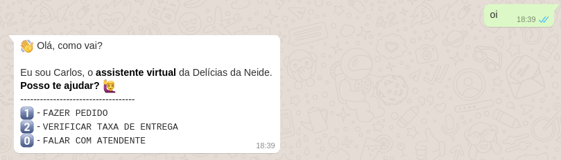
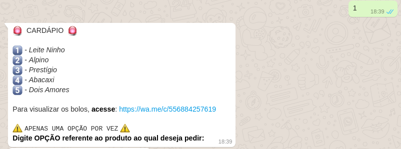
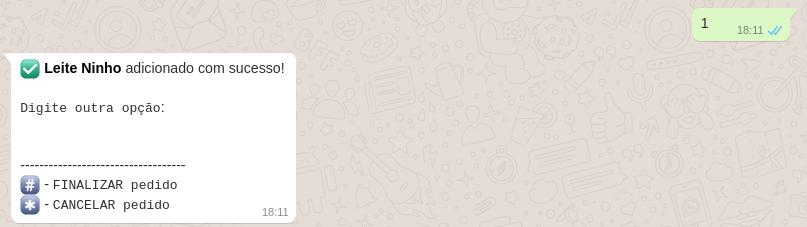
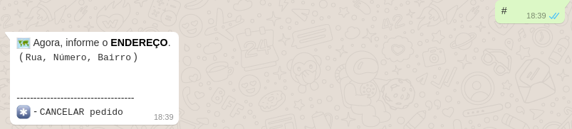
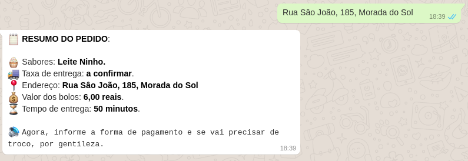
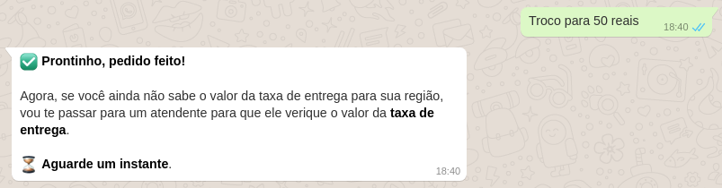

# Whatsapp Bot with VENOM-BOT

## Descrição do Projeto

<p align="center"></p>
<h1 align="center">
    <a href="https://nodejs.org/en/">🔗 NodeJS</a>
    <a href="https://www.npmjs.com/package/venom-bot">🧠 Venom Bot</a>
</h1>
<p align="center">🚀 Projeto criado com o intuito de auxiliar no atendimento do suporte técnico do Condomínio Solar de Brasília.</p>
<br>
<h1 align="center">
  Welcome
  
  Menu
  
  Order
  
  Address
  
  Bill
  
  Assistant
  
</h1>

### Pré-requisitos

Antes de começar, você vai precisar ter instalado em sua máquina as seguintes ferramentas:
[Git](https://git-scm.com), [Node.js](https://nodejs.org/en/).
Além disto, é bom ter um editor para trabalhar com o código como [VSCode](https://code.visualstudio.com/).

### 🎲 Rodando nossa aplicação

```bash
# Clone este repositório
$ https://github.com/AlanMarquesFerreira/ChatBotTi.git

# Acesse a pasta do projeto no terminal/cmd
$ cd ChatBotTi

# Instale as dependências
$ npm install

# Execute a aplicação em modo de desenvolvimento
$ yarn dev

## Pronto, escaneie o código QR do Whatsapp e Voilà, aproveite!
```

### 🛠 Tecnologias

As seguintes ferramentas foram usadas na construção do projeto:

- [Node.js](https://nodejs.org/en/)

### Autor

---

<a href="https://avatars.githubusercontent.com/u/124633669?s=400&u=e540322ec253640e22c1b90e080f6a6cb2afcfd3&v=4" width="100px;" alt=""/>
 <br />

Done with ❤️ by Alan Marques 👋🏽 !

[](https://twitter.com/juniorwmr) [](https://www.linkedin.com/in/AlanMarquesFerreira/)
[](mailto:alan.max213@gmail.com)
